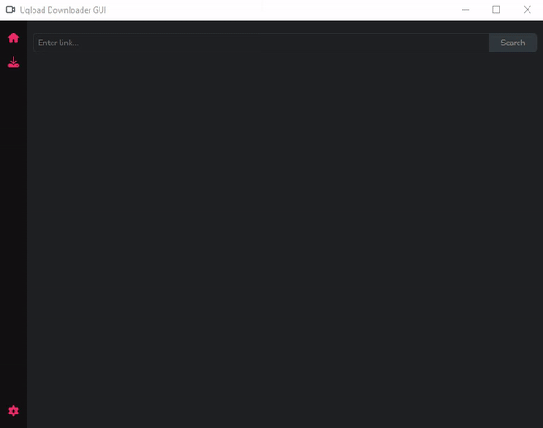

# Uqload Downloader GUI

A desktop application for downloading videos from Uqload. The application allows you to download videos simultaneously.

[CLI version](https://github.com/JoelFH23/uqload-downloader-python)

## Demo



## Requirements
- Python 3.9 or Higher.
- PyQt5.

## Installation

### Windows

- [Windows Portable or Windows Setup](https://github.com/JoelFH23/uqload-downloader-gui/releases)

**NOTE:** the portable and setup version have been tested only on **Windows 10**


### From Source Code

1. Clone the repository:

```bash
git clone https://github.com/JoelFH23/uqload-downloader-gui
cd uqload-downloader-gui
```

2. Install the package:

```bash
python -m pip install .
```

Alternatively, you can install it in development mode to easily make changes:

```bash
python -m pip install -e .
```

3. Now you can run **uqload-dl-gui** in the console
```bash
uqload-dl-gui
```

NOTE: if you get the error “FileNotFoundError: [Errno 2] No such file or directory” try reinstalling the package.

## Bug reports

Use the GitHub [issue](https://github.com/JoelFH23/uqload-downloader-gui/issues) tracker to submit bug reports.

## License

- [GPLv3](https://www.gnu.org/licenses/gpl-3.0)
